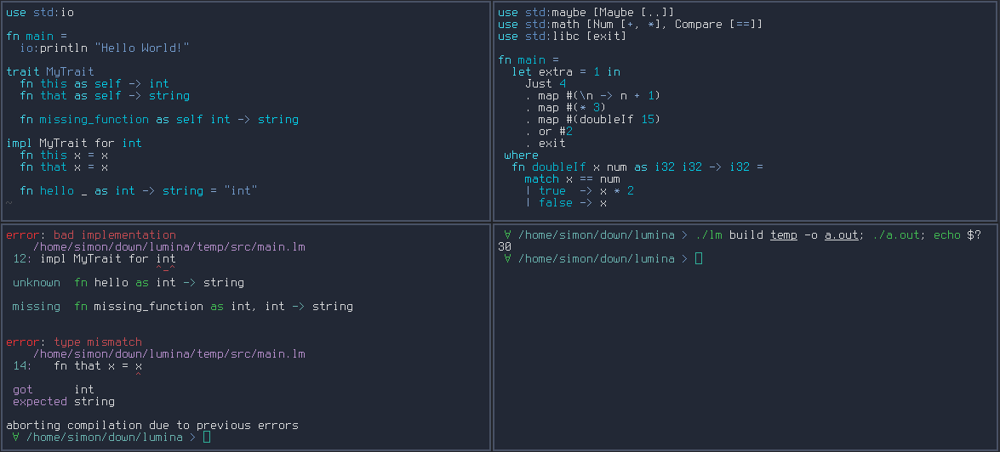

# Running

Currently there's two native targets with basic support for Linux only. 

`lumina build --target x86_64-linux-musl -o a.out sandbox/snippets`
`./a.out`

# Logging

This project is using `tracing_tree` combined with `env_logger`. To track a specific entity throughout the compilation pipeline, use: 
`RUST_LOG="[{entity=myFunction}]=trace"`

To get an overview look of what the compilers doing then use `RUST_LOG=info`

## Status

Most language features, basic and advanced, lower to LIR and can compile natively with Cranelift. The main blocker right now is the lack of a finished garbage collector.
All allocations currently leak unless manually freed with `do libc:free ptr then ...`. 

C-representation of declared data is currently not supported. To call FFI functions you need to write in primitives manually according to the C-abi.
Lumina's own ABI is currently a transparent representation of the data given. So; the C ABI can be followed manully on top. 

### Known remaining major tasks for public release

 - [ ] Garbage Collector (We now do allocation through the GC. But; we don't actually collect. For that we need a stronger runtime)
 - [x] Make `pub` actually have an effect. Our resolver has a system for visibility but we aren't using it. 
 - [ ] Basic guide/showcase
 - [ ] Replace all remaining `todo!("ET: ");`s with proper error messages
 - [x] Give the compiler the ability to detect and use system linkers
 - [x] Vectorised linked lists or finger trees as default list desugaring
 - [x] Fix the type checker sometimes confusing the expected type with the given type and vice-versa
 - [ ] Basic Windows target
 - [ ] Basic MacOS target
 - [ ] Basic introductory website hosted on our domain
 - [x] Re-add the unreachability warning messages
 - [x] Strings
 - [ ] Basic standard library
 - [ ] Floats
 - [ ] Reflection API with const-time folding post-monomorphization (plan is to use this instead of macros)

### Known remaining major tasks for after public release

 - [ ] Associated types
 - [ ] Trait-overloaded key-value syntactic sugar for hashmaps
 - [ ] Higher kinded types (monomorphised)
 - [ ] Documentation Generator
 - [ ] `@[repr "C"]` attributes and FFI-binding generator
 - [ ] Incremental compilation
 - [ ] Self-hosted compiler reimplementation
 - [ ] Stack backtraces and runtime debugging
 - [ ] Code formatter
 - [ ] Syntax files for various text editors
 - [ ] trait specialisation

### Known remaining minor tasks for after public release

 - [ ] Inline smaller sum-type data payloads for increased performance
 - [ ] Natively aligned data for improved performance
 - [ ] Stable public function symbols
 - [ ] Deduplicate ReadOnlyBytes
